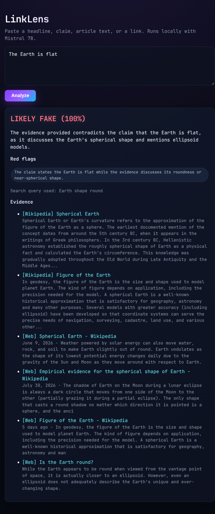

# LinkLens

**Local fake-news / claim checker.** Paste a headline, a claim, article text, or a URL — LinkLens judges it against live web evidence using a local LLM (Mistral 7B via Ollama), with zero data leaving your machine.


-8B5CF6)


---

## Demo



## What it does

1. **Accepts** a headline, a single claim, full article text, or a URL (articles are fetched server-side).
2. **Extracts** a short fact-checkable search query from the input with Mistral 7B.
3. **Gathers evidence** from Wikipedia and DuckDuckGo (retrieval-augmented generation).
4. **Judges** the claim against that evidence and returns a structured JSON verdict:
   `LIKELY REAL` / `LIKELY FAKE` / `UNVERIFIED`, with a confidence score, reasoning, red flags, and cited sources.
5. **Guards** the result with a deterministic post-processing layer:
   - a **regex override layer** that catches classic clickbait / misinformation patterns ("miracle cure", "doctors hate…", "share before it's deleted", ALL-CAPS sensationalism…);
   - an **evidence-alignment guardrail** that makes the verdict always match the model's own reading of the evidence (`supports → LIKELY REAL`, `contradicts → LIKELY FAKE`, `unrelated → UNVERIFIED`).

## Architecture

```
input (claim/text/URL)
    │
    ▼
┌──────────────────────┐   query   ┌─────────────────────────────┐
│ Mistral 7B (Ollama)  │─────────► │ retrieval: Wikipedia + DDG   │
│ query extraction     │           │ (RAG grounding)             │
└──────────────────────┘           └──────────────┬──────────────┘
                                                  ▼ evidence
┌──────────────────────┐   raw JSON   ┌──────────────────────────┐
│ Mistral 7B (Ollama)  │◄─────────────│  evidence assembly       │
│ claim judging        │              └──────────────────────────┘
└──────────┬───────────┘
           ▼
┌──────────────────────────────────────────────────────────────┐
│ post-processing: evidence_aligns guardrail + regex overrides  │
└──────────────────────────────┬───────────────────────────────┘
                               ▼
                    verdict + confidence + sources (JSON)
```

## Quick start

Requirements: **Python 3.10+**, **Ollama** running locally with the Mistral model pulled.

```bash
# 1. install
cd linklens
python -m venv venv
source venv/bin/activate          # fish: source venv/bin/activate.fish
pip install -r requirements.txt

# 2. pull the model (once)
ollama pull mistral      # or: ollama run mistral

# 3. run
python app.py            # -> http://127.0.0.1:5000
```

## Usage

Open http://127.0.0.1:5000, paste anything, and hit **Analyze**.

Or use the API directly:

```bash
curl -s http://127.0.0.1:5000/analyze \
  -H 'Content-Type: application/json' \
  -d '{"input": "The Earth is flat"}'
```

```json
{
  "verdict": "LIKELY FAKE",
  "confidence": 100,
  "overridden": false,
  "flipped": false,
  "evidence_aligns": "contradicts",
  "query": "Earth shape round",
  "reasoning": "The evidence provided contradicts the claim that the Earth is flat, as it discusses the Earth's spherical shape and mentions ellipsoid models.",
  "red_flags": ["The claim states the Earth is flat while the evidence discusses its roundness or near-spherical shape."],
  "regex_hard": [],
  "regex_soft": [],
  "sources": [
    { "source": "Wikipedia", "title": "Spherical Earth", "url": "https://en.wikipedia.org/wiki/Spherical_Earth", "snippet": "…" }
  ]
}
```

### API reference

| Endpoint | Method | Body | Returns |
|---|---|---|---|
| `/` | GET | — | Single-page UI |
| `/analyze` | POST | `{"input": "text or url"}` | Verdict JSON (200) or error message (400 / 502 / 503) |

## Design notes

- **Deterministic verdicts.** Small open models occasionally flip polarity on negated claims (e.g. "The Earth is flat" → `REAL` because the refutation evidence is "real"). LinkLens therefore asks the model for an `evidence_aligns` field and derives the verdict from it in code — the model's verdict token is advisory, not trusted.
- **SSRF protection.** Outbound article fetching checks every resolved IP against private/loopback/link-local/reserved ranges and re-checks each redirect hop.
- **Local-first.** All LLM inference happens on your hardware via Ollama; nothing is sent to a third-party model API.

## Disclaimer

Educational project. The model is a small 7B LLM and can be wrong; verdicts are best-effort. The dev server and quick-tunnel exposure are not meant for production — add auth and rate limiting before exposing publicly.